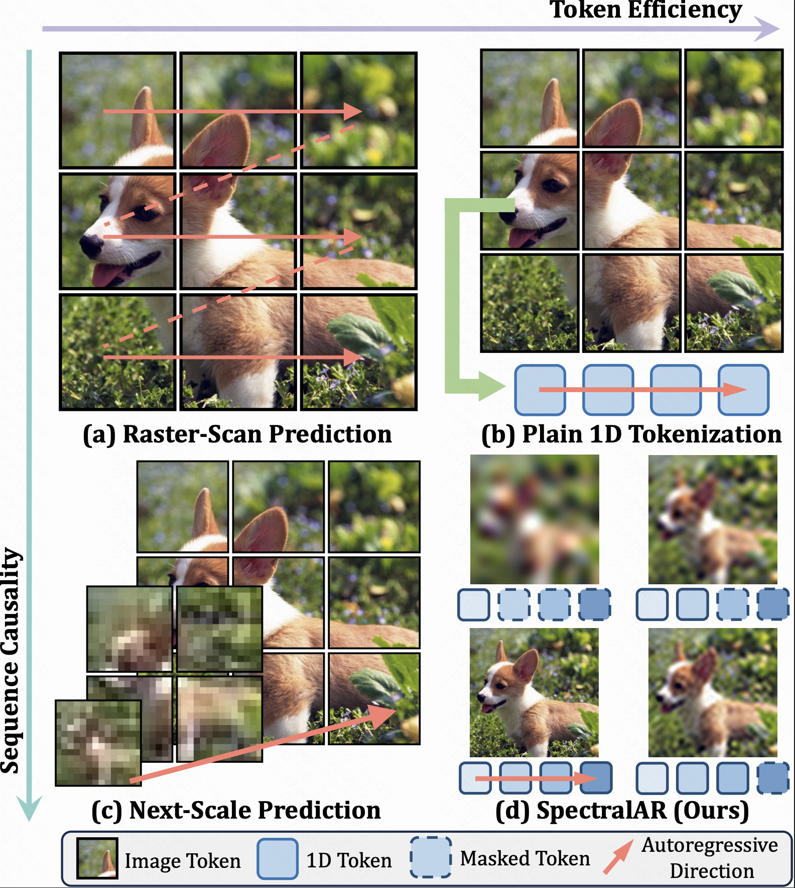
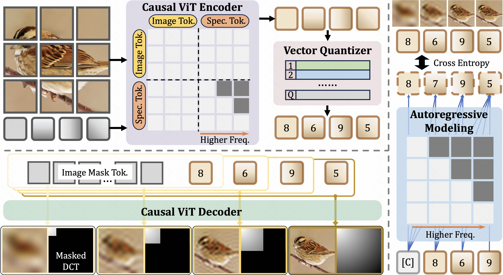
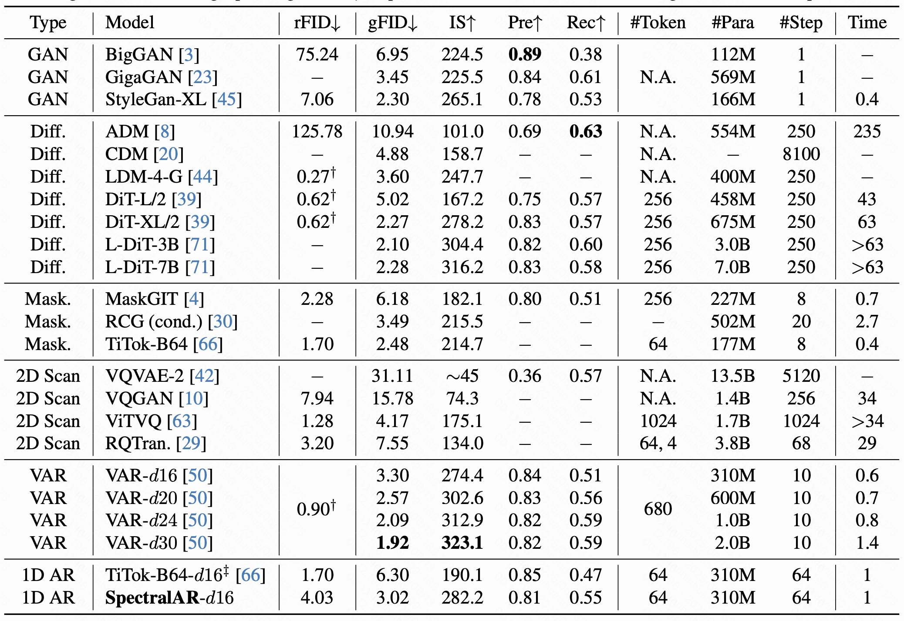

# SpectralAR: Spectral Autoregressive Visual Generation
### [[Paper]](https://arxiv.org/abs/2506.10962) [[Project]](https://huang-yh.github.io/spectralar/)

> SpectralAR: Spectral Autoregressive Visual Generation

> [Yuanhui Huang](https://huang-yh.github.io/), [Weiliang Chen](https://chen-wl20.github.io/), [Wenzhao Zheng](https://wzzheng.net/)$\dagger$, Yueqi Duan, [Jie Zhou](https://scholar.google.com/citations?user=6a79aPwAAAAJ&hl=en&authuser=1), [Jiwen Lu](http://ivg.au.tsinghua.edu.cn/Jiwen_Lu/)

$\dagger$ Project leader

We propose a Spectral AutoRegressive (SpectralAR) visual generation framework, which realizes causality for visual sequences from the spectral perspective.


## News.
- **[2024/12/14]** Paper released on [arXiv](https://arxiv.org/abs/2506.10962).
- **[2024/12/14]** Demo release.

## Demo


## Overview
<p align = "center"> 

</p>

Autoregressive visual generation has garnered increasing attention due to its scalability and compatibility with other modalities compared with diffusion models. Most existing methods construct visual sequences as spatial patches for autoregressive generation. However, image patches are inherently parallel, contradicting the causal nature of autoregressive modeling. To address this, we propose a Spectral AutoRegressive (SpectralAR) visual generation framework, which realizes causality for visual sequences from the spectral perspective. Specifically, we first transform an image into ordered spectral tokens with Nested Spectral Tokenization, representing lower to higher frequency components. We then perform autoregressive generation in a coarse-to-fine manner with the sequences of spectral tokens. By considering different levels of detail in images, our SpectralAR achieves both sequence causality and token efficiency without bells and whistles. We conduct extensive experiments on ImageNet-1K for image reconstruction and autoregressive generation, and SpectralAR achieves 3.02 gFID with only 64 tokens and 310M parameters.



## Performance
We train and evaluate our SpectralAR on the large scale ImageNet-1K dataset for both reconstruction and generation.



## Getting Started
We will release the code soon.

## Citation

If you find this project helpful, please consider citing the following paper:
```
@misc{huang2025spectralarspectralautoregressivevisual,
      title={SpectralAR: Spectral Autoregressive Visual Generation}, 
      author={Yuanhui Huang and Weiliang Chen and Wenzhao Zheng and Yueqi Duan and Jie Zhou and Jiwen Lu},
      year={2025},
      eprint={2506.10962},
      archivePrefix={arXiv},
      primaryClass={cs.CV},
      url={https://arxiv.org/abs/2506.10962}, 
}
```